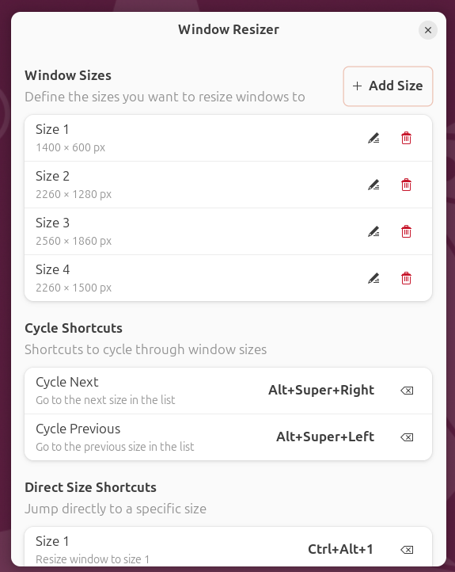
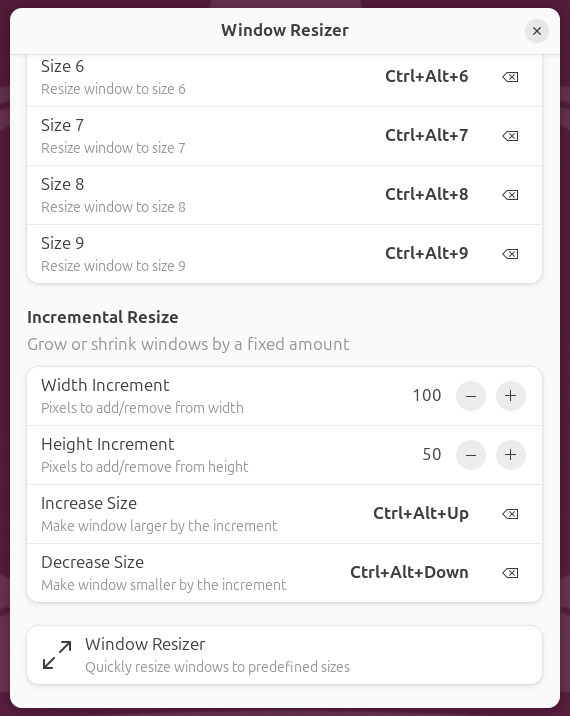

# GNOME Window Resizer

A GNOME Shell extension that allows you to quickly resize windows to predefined sizes using keyboard shortcuts.

## Features

- **Predefined Window Sizes**: Define custom window dimensions (e.g., 1000×500, 1920×1080)
- **Cycle Through Sizes**: Use shortcuts to cycle forward/backward through your sizes
- **Direct Size Shortcuts**: Jump directly to any size using Ctrl+Alt+1 through Ctrl+Alt+9
- **Small increments**: **Resize windows in small pixel increments using shortcuts**
- **Visual Settings UI**: Configure everything through GNOME's extension preferences
- **Wayland Compatible**: Works perfectly on both X11 and Wayland

### Cycle Through Sizes



### Small increments



## Installation

### From extensions.gnome.org (Recommended)

1. Visit [extensions.gnome.org](https://extensions.gnome.org)
2. Search for "Window Resizer"
3. Click the toggle to install

### Manual Installation

```bash
# Clone the repository
git clone https://github.com/JavierMonton/gnome-window-resizer.git
cd gnome-window-resizer

# Build and install
make install

# Restart GNOME Shell
# On Wayland: Log out and log back in
# On X11: Press Alt+F2, type 'r', press Enter

# Enable the extension
gnome-extensions enable gnome-window-resizer@javiermonton.github.io
```

## Usage

### Default Shortcuts

| Shortcut | Action |
|----------|--------|
| `Super+Alt+Right` | Cycle to next size |
| `Super+Alt+Left` | Cycle to previous size |
| `Ctrl+Alt+1` | Resize to size 1 |
| `Ctrl+Alt+2` | Resize to size 2 |
| `Ctrl+Alt+3` | Resize to size 3 |
| ... | ... |
| `Ctrl+Alt+9` | Resize to size 9 |

### Configuring Sizes

1. Open GNOME Extensions app (or Extension Manager)
2. Click the settings icon next to "Window Resizer"
3. Add, edit, or remove window sizes
4. Configure keyboard shortcuts as needed

## Default Sizes

The extension comes with three default sizes:
- 1000 × 500 pixels
- 1000 × 1000 pixels  
- 1920 × 1080 pixels

## How It Works

1. Focus on any window you want to resize
2. Press a shortcut (e.g., `Ctrl+Alt+1` for size 1)
3. The window is instantly resized while staying in place
4. Use cycling shortcuts to move through sizes sequentially

The extension remembers your current position in the size cycle for each window, so you can easily toggle between sizes.

## Compatibility

- GNOME Shell 45, 46, 47
- Ubuntu 24.04+
- Fedora 39+
- Any distribution with GNOME 45+

## Development

### Project Structure

```
gnome-window-resizer/
├── metadata.json          # Extension metadata
├── src/
│   ├── extension.js       # Main extension logic
│   ├── prefs.js           # Preferences UI (GTK4/Adwaita)
│   └── stylesheet.css     # Custom styles
├── schemas/               # GSettings schema
├── Makefile               # Build system
└── README.md
```

### Make Targets

```bash
make build      # Compile GSettings schemas
make install    # Install extension locally
make uninstall  # Remove extension
make package    # Create ZIP for extensions.gnome.org
make clean      # Remove build artifacts
make test       # Run basic validation
make dev        # Watch for changes and auto-install
make help       # Show all available targets
```

### Debugging

View extension logs:

```bash
journalctl -f -o cat /usr/bin/gnome-shell
```

Or filter for just this extension:

```bash
journalctl -f -o cat /usr/bin/gnome-shell | grep "Window Resizer"
```

## Contributing

Contributions are welcome! Please feel free to submit a Pull Request.

## License

This project is licensed under the GNU General Public License v3.0 - see the [LICENSE](LICENSE) file for details.

## Acknowledgments

- Built for the GNOME desktop environment
- Inspired by the frustration of tiling extensions resizing windows unexpectedly after leaving the layouts.
